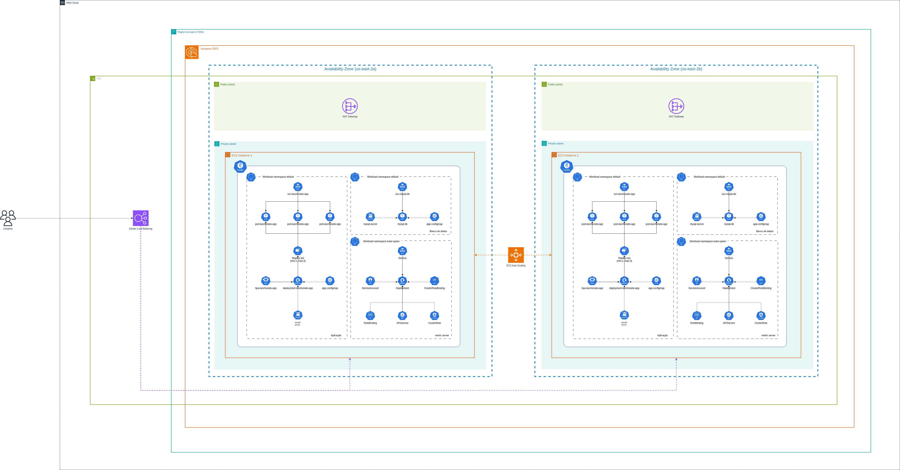

# Tech Challenge - API Cliente Lanchonete


API resopnsável por gerenciar o cadastro de clientes da Lanchonete.

# Pré-requisitos
1. Docker
   1. Para instalação [clique aqui](https://www.docker.com/get-started/)
2. Docker compose
   1. Para instalação [clique aqui](https://docs.docker.com/compose/install/)
3. Docker Desktop
   1. Para instalação [clique aqui](https://www.docker.com/products/docker-desktop/)
4. Habilitar o Kubernetes através do menu de configuração do Docker Desktop
   1. Após abrir o Docker Desktop, clique na engrnagem no canto superior direito;
   2. Vá em "Kubernetes"
   3. Habilite o Kubernetes selecionando o check box "Enable Kubernetes"

# Para executar o projeto:
1. Acesse via terminal a pasta do projeto
2. Execute em ordem os comandos abaixo: 
```bash
kubectl apply -f kubernetes --recursive  # você vai criar todos os recursos kubernetes que estão dentro da pasta 'kubernetes/'
```

### Obs.: Caso esteja utilizando o minikube para rodar seu cluster local, é necessário executar o campo abaixo:
```bash
kubectl get svc # neste comando você listará todas as services. Localize a service do app (svc-lanchonete-app-cliente)
kubectl port-forward svc-lanchonete-app-cliente 8080:80 # neste comando você vai direcionar todas as chamadas da porta 8080 para a porta 80 do cluster
```

#### Após os passos acima, a API estará funcionando e será possível realizar as operações, conforme descrito abaixo.

# Passo a passo funcional da API
1. Ao subir a aplicação, acesse o swagger [clicando aqui](http://localhost:8080/swagger-ui/index.html)
2. Ao acessar o swagger você poderá executar as operações disponíveis
   1. `POST /cliente` para cadastrar um novo cliente
   2. `GET /cliente` para listar todos os clientes cadastrados
   3. `DELETE /cliente/{cpf}` para deletar um cliente já cadastrado
   4. `PUT /cliente` para alterar um cliente já cadastrado
   5. `GET /cliente/{cpf}` para buscar um cliente por CPF


# Comandos úteis para o Kubernetes

### Apontar para o Kubernetes para seu cluster EKS AWS
```bash
aws eks update-kubeconfig --name eks-lanchonete --region us-east-1
```

### Deletar todos os recursos Kubernetes de uma só vez
```bash
kubectl delete all --all -n <namespace>
```

### Criar todos os recursos dentro do cluster de uma só vez
```bash
kubectl apply -f <path to files> --recursive
```

# Documentações

Link da documentação com o desenho do DDD: [Clique aqui para acessar o Miro](https://miro.com/app/board/uXjVKHPTdLg=/?share_link_id=544608334788)
<br>
Após subir a aplicação, para acessar o Swagger [Clique aqui](http://localhost:8080/swagger-ui/index.html)

# Desenho de arquitetura do projeto

